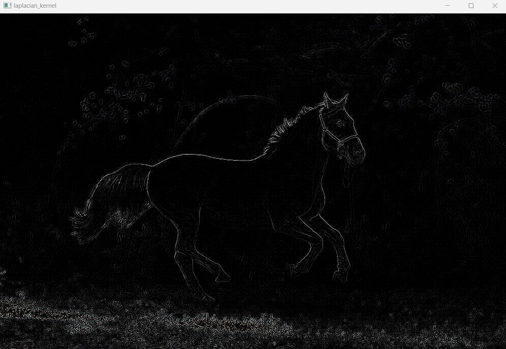

# Implementation-of-Filters
## Aim:
To implement filters for smoothing and sharpening the images in the spatial domain.

## Software Required:
Anaconda - Python  3.7

## Algorithm:
### Step1

Read and show the image
### Step2
Apply the filtering technique that we want to perform

### Step3
Show the filtered image


## Program:
               Developed By   : M.RAJESHKANNAN
               Register Number: 212221230081

### 1. Smoothing Filters

i) Using Averaging Filter
```
import cv2
import numpy as np
image = cv2.imread("horse.jfif")
original_image = cv2.cvtColor(image,cv2.COLOR_BGR2RGB)
cv2.imshow('original',original_image)
cv2.waitKey(0)
cv2.destroyAllWindows()

kernel1 = np.ones((11,11),np.float32)/121)
box_filter = cv2.filter2D(original_image,-1,kernel1)
cv2.imshow('box_filter',box_filter)
cv2.waitKey(0)
cv2.destroyAllWindows()

```
ii) Using Weighted Averaging Filter
```
import cv2
import numpy as np
image = cv2.imread("horse.jfif")
original_image = cv2.cvtColor(image,cv2.COLOR_BGR2RGB)
cv2.imshow('original',original_image)
cv2.waitKey(0)
cv2.destroyAllWindows()

kernel2 = np.array([[1,2,1],[2,4,2],[1,2,1]])/16
weighted_filter = cv2.filter2D(original_image,-1,kernel2)
cv2.imshow('weighted_filter',weighted_filter)
cv2.waitKey(0)
cv2.destroyAllWindows()

```
iii) Using Gaussian Filter
```
import cv2
import numpy as np
image = cv2.imread("horse.jfif")
original_image = cv2.cvtColor(image,cv2.COLOR_BGR2RGB)
cv2.imshow('original',original_image)
cv2.waitKey(0)
cv2.destroyAllWindows()

gaussian_blur = cv2.GaussianBlur(src = original_image, ksize = (11,11), sigmaX=0, sigmaY=0) 
cv2.imshow('gaussian_filter',gaussian_blur)
cv2.waitKey(0)
cv2.destroyAllWindows()

```

iv) Using Median Filter
```
import cv2
import numpy as np
image = cv2.imread("horse.jfif")
original_image = cv2.cvtColor(image,cv2.COLOR_BGR2RGB)
cv2.imshow('original',original_image)
cv2.waitKey(0)
cv2.destroyAllWindows()


median = cv2.medianBlur(src=original_image,ksize = 11)
cv2.imshow('median_filter',median)
cv2.waitKey(0)
cv2.destroyAllWindows()

```

### 2. Sharpening Filters
i) Using Laplacian Kernal
```
import cv2
import numpy as np
image = cv2.imread("horse.jfif")
original_image = cv2.cvtColor(image,cv2.COLOR_BGR2RGB)
cv2.imshow('original',original_image)
cv2.waitKey(0)
cv2.destroyAllWindows()

kernel3 = np.array([[0,1,0],[1,-4,1],[0,1,0]]) 
laplacian_kernel = cv2.filter2D(original_image,-1,kernel3)
cv2.imshow('laplacian_kernel',laplacian_kernel)
cv2.waitKey(0)
cv2.destroyAllWindows()

```
ii) Using Laplacian Operator
```
import cv2
import numpy as np
image = cv2.imread("horse.jfif")
original_image = cv2.cvtColor(image,cv2.COLOR_BGR2RGB)
cv2.imshow('original',original_image)
cv2.waitKey(0)
cv2.destroyAllWindows()

laplacian_operator = cv2.Laplacian(original_image,cv2.CV_64F)
cv2.imshow('laplacian_operator',laplacian_operator)
cv2.waitKey(0)
cv2.destroyAllWindows()

```

## OUTPUT:
### Original image

### 1. Smoothing Filters

i) Using Averaging Filter


ii) Using Weighted Averaging Filter


iii) Using Gaussian Filter


iv) Using Median Filter


</br>
### 2. Sharpening Filters

i) Using Laplacian Kernal



ii) Using Laplacian Operator


## Result:
Thus the filters are designed for smoothing and sharpening the images in the spatial domain.
